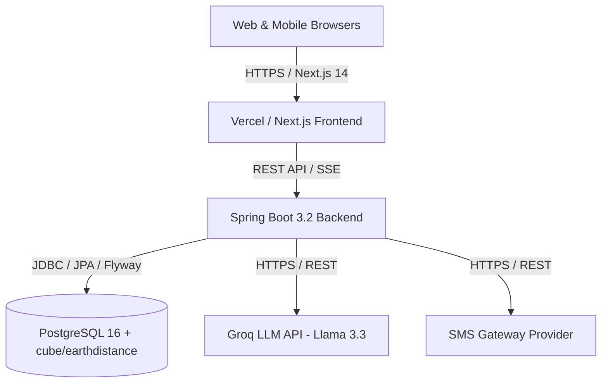

# Suwa Sarana — Production Deployment & Operations Guide

This guide provides end-to-end instructions for provisioning, configuring, containerizing, and deploying the **Suwa Sarana** blood coordination platform to production environments.

---

## Architecture Overview



- **Frontend**: Next.js 14 App Router, TypeScript, Tailwind CSS, Leaflet Maps, Lucide Icons. Hosted on Vercel or containerized with Node 20.
- **Backend**: Spring Boot 3.2 / Java 21, Spring Security, JJWT, Bucket4j rate limiting, Flyway migrations, SpringDoc OpenAPI 3.0. Hosted on Render, Railway, Fly.io, or Docker.
- **Database**: PostgreSQL 16+ with `cube` and `earthdistance` extensions for spherical spatial matching across 25 Sri Lankan districts.
- **AI Services**: Groq API (OpenAI-compatible) powering Multilingual Request Drafting (EN/SI/TA), Deferral Rule FAQ Chatbot, and Admin AI Fraud Triage.

---

## 1. Database Provisioning & Setup

Suwa Sarana relies on PostgreSQL native geometric extensions (`cube` and `earthdistance`) for sub-millisecond radius calculations without needing full PostGIS overhead.

### 1.1 Managed PostgreSQL (Supabase, Neon, AWS RDS, Railway)
Connect to your PostgreSQL database with administrative privileges and execute:

```sql
-- Enable spherical distance extensions
CREATE EXTENSION IF NOT EXISTS cube;
CREATE EXTENSION IF NOT EXISTS earthdistance;

-- Verify extension installation
SELECT earth_distance(ll_to_earth(6.9271, 79.8612), ll_to_earth(7.2906, 80.6337)) / 1000.0 AS distance_km;
-- Expected output: ~96.2 km (Colombo to Kandy)
```

### 1.2 Automated Flyway Migrations
Flyway runs automatically on Spring Boot application startup:
- `V1__init_schema.sql` — Core users, donors, requests, matches.
- `V2__add_trust_and_safety_tables.sql` — Reports, audits.
- `V3__seed_hospital_and_admin_accounts.sql` — Seed accounts.
- `V4__add_verification_status.sql` — User trust status (PENDING/VERIFIED/REJECTED).
- `V5__add_notification_logs.sql` — SSE + SMS fallback logs.
- `V6__add_donor_circles.sql` — Replacement circles & responses.
- `V7__add_ai_triage_fields.sql` — AI fraud risk score & explainable diagnostic flags.

---

## 2. Environment Variables Matrix

### Backend (`apps/backend/.env` or Platform Environment Variables)

| Variable | Required | Description | Example / Default |
| :--- | :--- | :--- | :--- |
| `DB_URL` | **Yes** | JDBC connection string to PostgreSQL | `jdbc:postgresql://postgres.db.host:5432/suwa_sarana_prod` |
| `DB_USER` | **Yes** | Database username | `postgres` |
| `DB_PASSWORD` | **Yes** | Database password | `StrongSecretPass123!` |
| `JWT_SECRET` | **Yes** | Base64-encoded 256-bit+ HMAC secret key | `dGhpcy1pcy1hLXZlcnktbG9uZy1zZWNyZXQta2V5LXRvLW1lZXQtam1hYy1yZXF1aXJlbWVudHM=` |
| `CORS_ALLOWED_ORIGIN` | **Yes** | Allowed frontend domain (no wildcard in prod) | `https://suwasarana.lk` |
| `SMS_PROVIDER_API_KEY` | Optional | SMS gateway provider API key | `sms_live_key_xxx` (default: `mock_key`) |
| `SMS_CASCADE_TIMEOUT_SECONDS`| Optional | Timeout before SMS fallback triggers | `180` (3 minutes) |
| `GROQ_API_KEY` | Optional | Groq Cloud API key for AI features | `gsk_xxxxxxxxxxxxxxxxxxxxxxxx` |

### Frontend (`apps/frontend/.env.production` or Vercel Environment Variables)

| Variable | Required | Description | Example |
| :--- | :--- | :--- | :--- |
| `NEXT_PUBLIC_API_URL` | **Yes** | Backend REST API base URL | `https://api.suwasarana.lk/api` |

---

## 3. Containerized Deployment with Docker Compose

To test or deploy the full stack locally or on a VPS (Ubuntu/Debian):

```bash
# 1. Clone repository
git clone https://github.com/Dhanushkamg/Suwa-Sarana.git
cd Suwa-Sarana

# 2. Configure environment variables in docker-compose.yml or .env
cp .env.example .env

# 3. Build and launch all services
docker compose up -d --build

# 4. Check service health
docker compose ps
```

- **Frontend UI**: `http://localhost:3000`
- **Backend API**: `http://localhost:8080/api`
- **Swagger / OpenAPI Documentation**: `http://localhost:8080/swagger-ui.html`

---

## 4. Deploying Backend to Cloud Platforms

### 4.1 Render / Railway / Fly.io

1. **Create a new Web Service**: Connect your GitHub repository `Suwa-Sarana`.
2. **Root Directory**: `apps/backend`
3. **Environment**: `Java` (or Docker)
4. **Build Command**: `./mvnw clean package -DskipTests`
5. **Start Command**: `java -jar target/backend-0.0.1-SNAPSHOT.jar`
6. **Set Environment Variables**: Set `DB_URL`, `DB_USER`, `DB_PASSWORD`, `JWT_SECRET`, `CORS_ALLOWED_ORIGIN`, `GROQ_API_KEY`.

---

## 5. Deploying Frontend to Vercel

1. **Import Project**: Import the `Suwa-Sarana` repository into Vercel.
2. **Root Directory**: Select `apps/frontend`.
3. **Framework Preset**: `Next.js`.
4. **Build Command**: `pnpm build` (or default Next.js build).
5. **Output Directory**: `.next`.
6. **Environment Variables**:
   - `NEXT_PUBLIC_API_URL`: URL to your live backend (e.g. `https://api.suwasarana.lk/api`).
7. **Deploy**: Click **Deploy**.

---

## 6. Zero-Secret Production Security Checklist

- [x] **No Hardcoded Secrets**: Ensure `application.yml` uses `${ENV_VAR:fallback}` only for local dev defaults.
- [x] **CORS Origin Strictness**: Verify `CORS_ALLOWED_ORIGIN` is configured to the exact production frontend domain (never `*`).
- [x] **Rate Limiting**: Built-in Bucket4j token bucket rate-limits `/api/auth/login`, `/api/auth/register`, and `/api/faq/ask`.
- [x] **Role-Based Authorization**: Critical blood requisitions restricted to verified hospital and admin accounts.
- [x] **Private Circles / Share Cards**: Public URLs `/circle/[token]` and `/share/[token]` intentionally omit personal patient identities and NIC numbers.
- [x] **Advisory AI Guardrails**: AI triage scoring never automatically alters request statuses—human administrator approval is always required.
